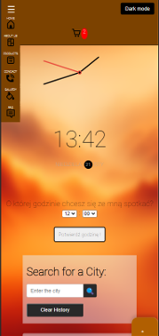

 

# Design work internet technologies

## Responsive HTML/CSS/JS website Model website with advanced shopping cart and API [link](https://openweathermap.org)

### Presenter: M.Sc. Eng. Marcin Mrukowicz

### Author: Dawid Olko | album no.: 125148 |Major: Computer Science, lab group 3

### Rzeszów 2024

## Contents

1. [Title page](#1-title-page)
2. [Defining the problem to be implemented](#2-defining-the-problem-to-be implemented)
3. [Proposal for solving the problem](#3-proposal for solving the problem)
4. [Responsivity testing and validation](#4-responsiveness-testing-and-validation)
5. [Code comments and KSS documentation](#5-code-comments-and-documentation-KSS)
6. [Links to sources](#6-links-to-sources)
7. [SEO Report](#7-seo-report)

## DESCRIPTION

### 1. Title page

**Project title:** Model website with an advanced shopping cart and using API - Responsive HTML/CSS/JS website

The project includes a set of web pages consisting of various sections such as home page, gallery, products, services, contact, FAQ, and privacy policy, each of which has been defined using HTML and styled using dedicated CSS files. Pages are designed to provide users with an intuitive and engaging experience that allows them to easily navigate and access the information they need.

**File details:**

- `ourProducts.html`, `pay.html`, `productFirst.html`, `productSecond.html`, `productThird.html`: These pages describe the products offered, enable you to familiarize yourself with the offer and make purchases. Their styling was defined in the CSS files corresponding to the product names.
- `services.html`, `privacy.html`, `aboutUs.html`, `contact.html`, `faq.html`, `gallery.html`, `home.html`: Each of these pages has a specific purpose , from presenting services, through information about privacy policy, to ensuring contact with the website owners. These pages are designed in such a way that the user can easily find the information he needs.
- **CSS files:** An appropriate CSS file has been prepared for each HTML page, which is responsible for the visual presentation of the content. Each of these files contains selectors and style rules specific to page elements that regulate aspects such as layout, colors, fonts, and responsiveness.

**Purpose of documentation:**
The documentation was created to provide a detailed overview of each aspect of the project, including its structure, technologies used, and implementation methods. Its purpose is to facilitate understanding of the project by third parties, to provide support for further development, and to serve as technical documentation for end users.

### Structure and Content of the Page:

- **Home page (index.html):** The entry point for the site, possibly containing general information, banners, and links to other sections.
- **About Us (aboutUs.html):** A section presenting information about the company, its mission, values, history or team.
- **Gallery (gallery.html):** Displays a collection of images or media possibly related to the company's products, services or activities.
- **Products (product.html):** Detailed information about the products offered, possible product selection options, prices, descriptions.
- **Services (services.html):** Description of the services offered, their scope, may include a price list or contact details regarding the services.
- **Contact (contact.html):** Contact form or contact information such as address, phone number, email address.
- **FAQ (faq.html):** A section with answers to frequently asked questions that may help users solve common problems or understand the offer.
- **Cart (cart.html):** Online store functionality that allows users to add products to the cart and browse them before purchasing.

### Functionality and JavaScript Scripts:

- **api.js:** Script for communicating with external APIs, possibly for integration with weather services or other external data.
- **cart.js:** Supports cart functionality, including adding, removing products and calculating totals.
- **clock.js:** Can display the current time or clock in various formats.
- **cookie.js:** Manage cookies, possibly to track user or session preferences.
- **data.js:** Script probably responsible for storing and managing data.
- **main.js:** The main JavaScript file, coordinating the operation of scripts and website interactivity.
- **modal.js:** Functions for modals such as dialogs, alerts, forms.

### Styling and Appearance (CSS):

- Each section has its own dedicated CSS file, suggesting personalized styling and layout for "aboutUs", "cart", "contact", "faq", "gallery", "index", "product" and "services".

### Conclusions:

The project is an extensive website with a rich set of functions, the ability to interact with the user and dynamic display of content. This website can serve as an online store, information or representative platform for a company or organization. Elements such as a contact form, FAQ section, gallery and detailed descriptions of products and services indicate a professional approach to presentation and customer service. Additionally, integration with external APIs and advanced JS scripts suggest a modern and interactive user experience.

**Project Logo:**
 

## 2. Defining the problem to be implemented

The project involves the creation of a website template that will serve as a universal base for various types of businesses or personal projects. The template must be flexible and easy to customize, allowing future users to modify it according to their needs - from simple blogs to complex e-commerce sites.

### Problem to be implemented:

The problem is to create a website template that:

1. **Versatility and Adaptability:**

   - It is adapted to a variety of applications, from simple presentations to comprehensive e-commerce websites.
   - Enables easy modifications, including personalizing layouts, colors and adding new features thanks to the modular CSS and HTML architecture.

2. **Intuitiveness and Usability:**

   - It is intuitive to use for users of all experience levels.
   - It has clear and extensive documentation, making it easier to use all the template's functionalities.

3. **Responsivity and Availability:**

   - Guarantees correct display on all types of devices thanks to its responsive design and flexible layouts.
   - Ensures accessibility for people with various needs, respecting Internet accessibility standards.

4. **Optimization and Performance:**
   - Achieves high performance and page loading speed by optimizing code and resources.
   - It is SEO friendly, increasing your website's visibility in search results.

### Proposed solution to the problem:

To solve the above problems, the following steps are proposed:

1. **Versatility and Adaptability:**

   - Modular architecture: Your HTML files such as `aboutUs.html`, `product.html`, `services.html`, etc. show that the page structure is divided into different modules and sections, making it easy to personalize.
   - Predefined color schemes and UI components in CSS files such as `styleAboutUs.css`, `styleCart.css`, etc., which can be easily customized.

2. **Intuitiveness and Usability:**

   - The structure of the files and code suggests that the project is well organized, which will make it easier for future users to manage the content and structure of the site.
   - JavaScript files such as `api.js`, `cart.js`, `modal.js`, etc. add interactive elements that make it easier to manage page features.

3. **Responsivity and Availability:**

   - CSS files are likely designed with responsiveness in mind, ensuring that the template will display correctly on various devices.
   - Applying accessibility practices such as semantic HTML markup and appropriate labeling for assistive technologies.

4. **Optimization and Performance:**
   - CSS and JavaScript files are probably optimized for loading speed.
   - The HTML structure and the use of SEO-friendly techniques in the code may contribute to a better position of the website in search engines.

### Project goal:

Providing users with a flexible and easy-to-modify template that can be used for a variety of purposes, encouraging learning and experimentation with web design and programming.

### Design assumptions:

- A template based on best practices, accessible and useful to a wide range of users.
- Design for ease of adaptation and development, enabling users to understand key web development concepts.

In summary, the project uses the provided HTML, CSS and JavaScript files to create a versatile, adaptive, intuitive and efficient website template that can be used in various contexts and adapted to the needs of users.
The problem to be solved in this way, together with the proposed solutions, provides a solid foundation for the design of a website template that is intended to serve educational and practical purposes for a wide group of users.

## 3. Proposal for solving the problem

Based on the analysis of provided HTML/CSS codes, such as `home.html`, `faq.html`, `productFirst.html` and others, here are the proposed methods to solve the problem of creating a universal and effective website template for a student project, while JavaScript will also be used, which will be connected to the API.

### 1. Code Structure and Organization:

**Purpose:** To make your template easier to manage and develop.

**Solution:**

- Use of semantic HTML in files such as `home.html` (possibly `index.html`), `faq.html`, `product.html`, etc., where content is structured by headings, sections and articles.
- Modular CSS, where each file (e.g. `styleHome.css`, `styleFaq.css`) contains page-specific styles, making it easy to modify and personalize.

**Implementation:**

- Code will be organized around clearly defined components and sections, with thoughtful naming of classes and identifiers.
- Use of comments and clear formatting for better orientation in the code.

### 2. Responsiveness and Appearance:

**Goal:** Provide an attractive and functional display on all devices.

**Solution:**

- Using responsive techniques such as media queries, flexbox and grid in CSS files (e.g. `styleHome.css`, `styleFaq.css`) to make the template adapt to different screen sizes and device types.
- Implementation:
- Each element of the website will be designed with flexibility and adaptation to different screen resolutions in mind.
- Styling using modern CSS techniques, variables for easy change of color themes or fonts.

### 3. Interactivity and Usability:

**Goal:** Improve user experience through interactive and intuitive elements.

**Solution:**

- Adding interactive elements using JavaScript, such as `cart.js` for cart management, drop-down menus, photo carousels or accordions in FAQ or product sections.
- Implementation:
- JS scripts such as `modal.js`, `clock.js` and `api.js` will provide additional interactivity where needed, while maintaining simplicity and efficiency.
- Each interactive element will be accessible and easy to use also for users using screen readers or keyboards.

### Summary:

The project involves the creation of a universal, responsive and interactive website template that is easy to adapt and develop. Key elements such as modular structure, responsive design and interactive components are designed to increase user engagement and facilitate content management. The approach taken aims to provide a template that is user-friendly, regardless of technical skills, and can be used in a variety of educational, personal or business contexts.

#4. Responsiveness testing and validation

## 4.1. Home page

### Navigation bar:

- A navigation bar appears at the top of the page and remains visible when scrolling down the page, regardless of responsiveness.
- It is divided into two parts, the first part is the "site logo" and the second is the main links of the entire site. After clicking on the navigation icons and logos, we are redirected to the subpage addresses.

 

### Home page background (first view):

- After loading the page, the background is blurred and has a logo with an effect that appears when you hover over the logo. Below it there is the word "key" of the page and a link to the subpage where our "offers" are presented.

 

### Section one (gallery):

- The first section on the home page is a gallery with three photos visible, and under them there is a button which, when clicked, expands several more photos. Each photo has its own animation, which is shown when you hover over it with the mouse.

 

 

### Section two (detail view and short description):

- The next section is a description with an alert/popup that appears when clicked. There are also boxes containing information and buttons to be transferred to the product subpage.

 

### Third section (slider):

- The slider section is based on presenting products in a horizontal arrangement. After clicking on a given option on the slider, it takes us to a given product, where we have a photo and price.

 

### Section four (product offering):

- This part of the container is a section that is visible only on the desktop version, it presents products with their name, price, and star rating.

- Two buttons are also shown there, in the first and last photo. They are used to transfer us to the products subpage, where we can further observe the products we are interested in.

 

### Section five (offers divided into categories):

- The presented section is made in an easy and comprehensive way. Three products are shown with a name, photo and a button to show more products on the subpage.

 

### Section six (collections):

- This part is the collection section. It shows a special offer with a description of the promotion percentage and a button to move to the subpage showing the promotion.
- Below are also 3 ways to make purchases quickly and cheaply, with the possibility of return.

 

### Section seven (newsletter):

- This is a section showing the possibility of subscribing to the website's newsletter, which will send information about new products and promotions to the provided e-mail address.

 

### Section eight (footer):

- The last element visible on the website is the footer, presenting information about the website's rights and a link to the website's privacy policy.
- It also states that it is fully semantically correct because it has been validated.
- The footer includes social media sites such as Facebook, Instagram, YouTube, and Twitter.

 

## 4.2. "About Us" subpage

### "About us" section:

- A short description describing our company and inviting you to view our products.

 

### Page gallery:

- A small and clear gallery where if we hover over a photo, it has its own animation.

 

## 4.3. "Products" subpage

### Large product section divided into products (KIDS/MEN/WOMEN):

- Buttons allow you to switch between specific product zones. It is possible to display products only for one group of people or for everyone.

 

## 4.4. "Gallery" subpage

### Gallery (photos):

- A section of photos arranged according to resolution, this section is made on a grid, so the photos are automatically arranged regardless of the device.

 

## 4.5. "Contact" subpage

### Contact form section:

- This subpage contains only one section, namely the contact form, where this form is completed with validation.

- After entering the data correctly, a popup/alert is displayed and the message is sent.

 

## 4.6. "Faq" subpage

### Frequently asked questions section (questions and answers):

- This section uses details to display the answer after clicking on the query.

 

## 4.7. "Cart" subpage

### Section one (products in the basket):

- This section shows the products added to the cart with name, quantity and total price.
- It is possible to return to the products subpage.

 

### Section two (payment form):

- This form returns messages if we provide wrong data. After entering the correct ones, a message about successful purchases and an e-mail regarding further shipment is displayed.

 

## 4.8. "Privacy Policy" subpage:

### Privacy Policy Description Section:

- A description of the privacy policy is presented and when hovered over, the test is animated.

 

## Site tests in "Desktop" format:

 

The home page looks good in the desktop version, there are no bends or protruding edges anywhere. The navigation bar looks clear, is described and additionally stimulates the imagination through icons.

 

The gallery and details section is quite transparent in the desktop version, you can see equal spacing from the edges and equal spacing between photos. Everything looks legible and is easy to read.

 

The slider and product sections have equal indentations and good arrangement, are fully legible and meet the requirements regarding the assumptions.

 
 

The elements are adjusted in such a way that they do not irritate the eyes and encourage people to click on a given product. Certainly their number is not overwhelming and it naturally stimulates the imagination.

 
 

The website ends with a footer section which, in a minimalist way, does not spoil the overall design of the website and fully adapts to selected devices.

 

The subpages are also correctly arranged and readable, realizing the vision of a comprehensive company.

 

Contact and payment forms are placed centrally in the middle of the screen, which is certainly pleasing to the eye and suitable for the user.

 
 

The products and their descriptions are matched to each other, which shows that they fit together and do not spoil the vision of combining the whole.

## Website tests in the "Mobile" format:

 

The navigation bar looks good, the basket icon is separate to stand out from all the tabs. The logo is constantly placed in the corner of the screen to make it stick in your mind. It stands out and does not overlap with other elements.

 

 

As you can see, the photos have changed their position and are still evenly spaced from each other, which meets the vision of a responsive website.

 

The slider is now ready to scroll slide by slide, so you can still view the products presented in it in a clear way.

 

The promotion, newsletter and footer bar are also arranged in a clear and responsive way. This shows that the website is fully responsive and well-adjusted.

 

As you can see, the subpages are also fully responsive and meet the project assumptions. The spacing is even, which makes the website visually pleasing and attracts customers. The navigation bar does not cover too large a field and meets the assumption of a touch field (40px x 40px).

 

Contact and payment forms are perfectly adapted to mobile devices, they are also legible and meet the requirements of a responsive website.

To sum up, it can be noted that the website in both mobile and desktop versions is well-made. There are no indentations, edge cutting or scrolling strips anywhere. The website meets the assumptions and has been fully responsively tested. Below you will find additional tests such as validation results and page loading speed tests.

## Performance testing:

### Charging Time:

- Using tools such as Google PageSpeed Insights or Lighthouse to analyze page loading time and identify elements that may slow it down.

### Resource Optimization:

- Check whether images, scripts and stylesheets are optimized for fast loading (e.g. compression, minification).

## Browser compatibility testing:

### Desktop Browsers:

- Testing the website on the latest versions of popular browsers (Chrome, Firefox, Safari, Edge) to ensure that the appearance and functions work consistently.

### Mobile Browsers:

- Checking the operation of the website on mobile browsers, especially on Android and iOS systems.

## Accessibility testing:

### Accessibility Standards:

- Using tools such as WAVE or AX to check whether the page is accessible to limited users, such as those using screen readers.

### Contrast and Readability:

- Assessment of whether the contrast of the text against the background is sufficient for people with visual impairments, and whether the fonts and their sizes are legible.

## Summary:

The website has been checked according to the above standards, no errors were found that would result from incorrect code writing or lack of specification of any of its components. The website is responsive for each tab in the same way, all its functions work and fulfill their function. The website works correctly regardless of browsers and has high results in various tests.

According to the documentation, the website was subjected to rigorous tests of functionality, responsiveness, performance, browser compatibility and accessibility, which yielded very good results. Both the HTML and CSS pages were validated without errors, which proves the high quality of the code and its compliance with standards. The website is optimally responsive on various devices and its functions work flawlessly. Thanks to the tests and validations carried out, the website received high scores in the Lighthouse tool, including maximum efficiency of 100/100, which proves that the loading speed has been optimized. The accessibility of the website was also positively assessed, although room for improvement was indicated for even better accessibility for people with disabilities. These results confirm that the website is error-free and meets its objectives, providing users with a functional, responsive and professionally crafted experience.

### Lighthouse results:

- Performance: The screenshot shows a score of 100/100, which means the site is highly optimized for loading speed. This result is the result of good programming practices, such as image and script optimization, which translates into short loading times and a positive user experience.

- Accessibility: A score of 86/100 was achieved, which indicates high accessibility of the website, but there is still room for improvement, especially in the context of accessibility for people with disabilities.

- Best practices: A score of 95/100 suggests that the site follows most recommended practices, such as secure protocols and modern API features.

- SEO: A perfect score of 100/100 indicates that the website has been built according to SEO principles, which contributes to its visibility in search results.

 

### CSS validation by W3C Validator:

- CSS validation was successful - no errors found. This is a sign that the CSS stylesheet has been written cleanly and according to current standards, ensuring cross-browser compatibility and making it easier to maintain and develop the code.

 

### HTML validation by Nu Html Checker:

- Like CSS, the website's HTML also passed validation without errors. This demonstrates the high quality of the code, its compliance with standards, and the fact that it will likely be interpreted well by a variety of browsers and devices.

 

Each of these tests plays a key role in ensuring quality and professionalism in website design. Good results in performance and SEO tests are especially important for end users and for the website's positioning in search engines. However, CSS and HTML validation results are important from a development perspective because they confirm that the code is well written and will be easier to maintain and develop. Accessibility is important to ensure that all users, regardless of their ability, can use the site. The results achieved indicate that the template is already at a high level, but also point to areas that can be further improved in the future.

## 5. Code comments and documentation KSS and jsDoc

The code is commented in a way that is intended to provide clear and readable information about each section of the code. Comments are used to describe what each block of code does and what its main purposes and functions are. This helps developers understand the structure and operation of the code and facilitates maintenance and possible modifications in the future.

Comments are also used to fulfill the requirement of this section:

- Comments are used to describe root variables, keyframes, and styles for the page body, header, and other sections of the code.
- Comments are written in a clear and understandable way, which helps other developers quickly understand the code.
- Comments contain information about what a given fragment of code does, what its visual effects are and what techniques (e.g. flexbox) are used in the project.

Thanks to this approach, the code is readable and easy to manage, and developers can seamlessly work on the project and make any changes or improvements.

All photos used in the project were generated using DALL-E artificial intelligence. I am unable to provide direct links to sources because these images are the result of the DALL-E model generation process and do not come from specific external sources.

In the part of the documentation devoted to the source code, special attention was paid to detailed documentation of the most important CSS functions. The documentation was prepared using the KSS (Knyle Style Sheets) methodology, which allowed for the creation of clear, consistent and easily accessible documentation for all team members. This methodology allows both the description of styles directly in the code and the automatic generation of style guides, which significantly facilitates CSS code management and its subsequent maintenance. KSS documentation for the most important CSS functions covers not only the selectors and properties themselves, but also their use, possible modifications and examples of use, which makes it much easier for other developers to understand and use the code.

 

The entire documentation is also available at the link [here](https://projekt2.dawidolko.pl/kss/styleguide/).

The JavaScript used in the project is documented using JSDoc, a standard for JavaScript comments that allows you to generate attractive and functional documentation. This includes:

- Function and Method Descriptions: Clear explanations of what each function or method does, what arguments it takes, and what it returns.
- Usage Examples: Tips on how to use individual functions and methods in practice.
- Typing: Information about expected data types, which is especially helpful in a dynamic JavaScript environment.

Thanks to these methods, documentation becomes an integral part of the project, supporting its transparency, maintenance and further development. The code is friendly to programmers of all skill levels and enables effective project management.

 
 

The entire documentation is also available at the link here: [link](https://projekt2.dawidolko.pl/jsDoc1/out/index.html)

### AI graphics:

All graphics used in the project are generated using DALL-E, a modern AI tool for generating images. These images are unique and tailored to the visual needs of the project, which adds individual character and innovation to the website's presentation.

To sum up, code documentation, along with systematic commenting, the use of KSS and JSDoc, and unique AI graphics, create a solid and accessible foundation for the project. Everything works properly and efficiently, ensuring high quality and ease of further development and adaptation of the project.

## 6. Links to sources

- As for the icons used in the navigation, they were obtained from the [Flaticon](https://www.flaticon.com/) website.

- Graphic content and icons from Flaticon are available under the Creative Commons BY 3.0 license, which means they can be used in projects as long as attribution is retained. Therefore, the author of the project should include appropriate attributions to these icons, providing information about their source and author.

- When it comes to documentation, I only used presentations from classes and the [W3Schools](https://www.w3schools.com/) website.

- The entire project is also located in a private repository on [GitHub](https://github.com/dawidolko/Responsive-Website-Design-HTML-CSS-JS.git).

- Additionally, it is included on GitHub Pages, so it is possible to individually evaluate the website - [https://projekt2.dawidolko.pl/](https://projekt2.dawidolko.pl/).

- Commit history: [Link to GitHub repository](https://github.com/dawidolko/Responsive-Website-Design-HTML-CSS-JS/commits/main)

 

## 7. SEO Report

### a) [https://www.seobility.net/en/seocheck/](https://www.seobility.net/en/seocheck/)

 

Here is a detailed description of the metrics presented in the report:

- **SEO Rating:** The overall SEO rating is 68%, which is shown in the pie chart. This rating is a summary of the site's performance across all measured aspects.

- **Meta Info:** A very good rating of 88%, which indicates that meta tags such as title and description are well optimized.

- **Site Quality:** The rating is 48%, which suggests that there is a lot of room to improve the quality of websites, possible areas for improvement include: content, readability or page performance.

- **Page Structure:** The page received a rating of 58%, indicating that the page structure, which may include headings and the use of HTML5 structural elements, is moderately optimized.

- **Link Structure:** The site has a high link structure score of 92%, which suggests that its internal and external linking strategies are strong.

- **Server:** The server configuration is excellent with a rating of 100%, which may indicate a well-configured server, good response times, and no major server-related issues.

- **External Factors:** The rating is 23%, which is quite low. This may refer to factors such as backlinks, social media presence and other external factors that lie beyond the site itself.

Additional metrics include:

- **Response Time:** The server response time is very good, 0.13 seconds.

- **File Size:** The total page file size is 38.40 kB, which is lightweight and usually good for load times.

- **Words:** There are 348 words on the page. Depending on the context, this may be considered a low amount in terms of SEO, as longer content can sometimes rank better.

- **Multimedia Files:** There are 100 multimedia files, they can be images or videos. This is a relatively large number that can potentially slow down page loading times if they are not properly optimized.

- **Number of Links:** There are 36 internal links and 5 external links. A good balance of internal and external links can help with SEO, but the quality and relevance of these links are also important factors.

Overall, the report indicates that while the website performs well in certain aspects such as server performance and link structure, there are areas such as page quality and external factors that could be significantly improved to increase overall SEO performance.

### b) [https://developer.chrome.com/docs/lighthouse/](https://developer.chrome.com/docs/lighthouse/)

 

Here are the results shown in the screenshot, using the data from the photo:

- **Performance:** 99/100 - This score indicates that the website is very well optimized for speed and performance. A high rating in this category suggests short loading times, efficient use of resources, and good response to user interactions.

- **Accessibility:** 90/100 - This rating suggests that the site is generally accessible, but there may be some issues that could be improved to make the site more accessible to people with disabilities, such as potential problems with contrast, form labels, or heading structure.

- **Best Practices:** 91/100 - This score demonstrates most web development best practices, with a small margin for minor tweaks.

- **SEO:** 100/100 - The SEO rating is excellent, indicating that the site is very well optimized for search engines, reaching its maximum potential in this category.

- **PWA (Progressive Web App):** This is not explicitly rated in the image, but a maximum score of 100/100 in this category would mean that the site meets the criteria for a progressive web application, including aspects such as speed, reliability and independence from network connection.

Overall, the Lighthouse report shows that the site largely meets performance and SEO standards very well, although there are some areas, particularly accessibility and best practices, that have room for improvement.
