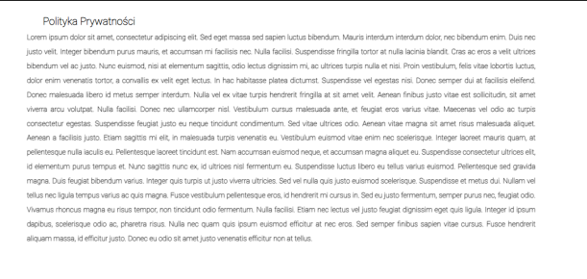

  
# Praca projektowa technologie internetowe
## Responsywna strona HTML/CSS/JS Wzorcowy Serwis Internetowy z zaawansowanym koszykiem oraz z wykorzystaniem API [link](https://openweathermap.org)

### Prowadzący:	mgr inż. Marcin Mrukowicz	
### Autor: Dawid Olko | nr albumu: 125148 |Kierunek: Informatyka, grupa lab 3
### Rzeszów 2024

## Spis treści
1. [Strona tytułowa](#1-strona-tytułowa)
2. [Zdefiniowanie problemu do realizacji](#2-zdefiniowanie-problemu-do-realizacji)
3. [Propozycja rozwiązania problemu](#3-propozycja-rozwiązania-problemu)
4. [Testowanie responsywności i walidacja](#4-testowanie-responsywności-i-walidacja)
5. [Komentarze kodu i dokumentacja KSS](#5-komentarze-kodu-i-dokumentacja-kss)
6. [Linki do źródeł](#6-linki-do-źródeł)
7. [Raport SEO](#7-raport-seo)

 
## OPIS

### 1. Strona tytułowa

**Tytuł projektu:** Wzorcowy serwis internetowy z zaawansowanym koszykiem oraz z wykorzystaniem API – Responsywna strona HTML/CSS/JS

Projekt obejmuje zestaw stron internetowych składających się z różnorodnych sekcji, takich jak strona główna, galeria, produkty, usługi, kontakt, FAQ, i polityka prywatności, z których każda została zdefiniowana przy użyciu HTML i stylizowana za pomocą dedykowanych plików CSS. Strony są zaprojektowane z myślą o dostarczeniu użytkownikowi intuicyjnego i angażującego doświadczenia, umożliwiającego łatwe nawigowanie i dostęp do potrzebnych informacji.

**Szczegóły dotyczące plików:**
- `ourProducts.html`, `pay.html`, `productFirst.html`, `productSecond.html`, `productThird.html`: Strony te opisują oferowane produkty, umożliwiają zapoznanie się z ofertą oraz dokonywanie zakupów. Ich stylizacja została zdefiniowana w plikach CSS odpowiadających nazwami produktom.
- `services.html`, `privacy.html`, `aboutUs.html`, `contact.html`, `faq.html`, `gallery.html`, `home.html`: Każda z tych stron pełni specyficzne zadanie, od przedstawienia usług, przez informowanie o polityce prywatności, aż po zapewnienie kontaktu z właścicielami serwisu. Strony te są zaprojektowane w taki sposób, aby użytkownik mógł łatwo znaleźć potrzebne informacje.
- **Pliki CSS:** Dla każdej strony HTML przygotowano odpowiedni plik CSS, który odpowiada za wizualną prezentację treści. Każdy z tych plików zawiera selektory i reguły stylów specyficzne dla elementów strony, które regulują aspekty takie jak layout, kolory, czcionki, oraz responsywność.

**Cel dokumentacji:**
Dokumentacja została stworzona w celu zapewnienia szczegółowego przeglądu każdego z aspektów projektu, włącznie z jego strukturą, używanymi technologiami, oraz metodami implementacji. Ma ona na celu ułatwić zrozumienie projektu przez osoby trzecie, zapewnić wsparcie w dalszym rozwoju, oraz służyć jako dokumentacja techniczna dla użytkowników końcowych.

### Struktura i Treść Strony:

- **Strona główna (index.html):** Punkt wejściowy witryny, prawdopodobnie zawierający ogólne informacje, banery i linki do innych sekcji.
- **O nas (aboutUs.html):** Sekcja przedstawiająca informacje o firmie, jej misji, wartościach, historii lub zespole.
- **Galeria (gallery.html):** Wyświetla zbiór obrazów lub multimediów, prawdopodobnie związanych z oferowanymi produktami, usługami lub działalnością firmy.
- **Produkty (product.html):** Szczegółowe informacje o oferowanych produktach, możliwe opcje wyboru produktu, ceny, opisy.
- **Usługi (services.html):** Opis oferowanych usług, ich zakresu, może zawierać cennik lub sposób kontaktu w sprawie usług.
- **Kontakt (contact.html):** Formularz kontaktowy lub informacje kontaktowe, takie jak adres, numer telefonu, adres e-mail.
- **FAQ (faq.html):** Sekcja z odpowiedziami na często zadawane pytania, mogące pomóc użytkownikom w rozwiązaniu typowych problemów lub zrozumieniu oferty.
- **Koszyk (cart.html):** Funkcjonalność sklepu internetowego, pozwalająca użytkownikom na dodawanie produktów do koszyka i przeglądanie ich przed zakupem.

### Funkcjonalność i Skrypty JavaScript:

- **api.js:** Skrypt do komunikacji z zewnętrznymi API, prawdopodobnie do integracji z usługami pogodowymi lub innymi zewnętrznymi danymi.
- **cart.js:** Obsługa funkcjonalności koszyka, w tym dodawanie, usuwanie produktów i obliczanie sumy.
- **clock.js:** Może wyświetlać aktualny czas lub zegar w różnych formatach.
- **cookie.js:** Zarządzanie ciasteczkami, prawdopodobnie do śledzenia preferencji użytkownika lub sesji.
- **data.js:** Skrypt prawdopodobnie odpowiedzialny za przechowywanie i zarządzanie danymi.
- **main.js:** Główny plik JavaScript, koordynujący działanie skryptów i interaktywność strony.
- **modal.js:** Funkcje dla modali, takie jak okna dialogowe, alerty, formularze.

### Stylizacja i Wygląd (CSS):

- Każda sekcja ma swój dedykowany plik CSS, sugerujący spersonalizowaną stylizację i układ dla "aboutUs", "cart", "contact", "faq", "gallery", "index", "product" oraz "services".

### Wnioski:

Projekt jest rozbudowaną witryną internetową z bogatym zestawem funkcji, możliwością interakcji z użytkownikiem oraz dynamicznym wyświetlaniem treści. Strona ta może służyć jako sklep internetowy, platforma informacyjna lub reprezentacyjna dla firmy lub organizacji. Elementy takie jak formularz kontaktowy, sekcja FAQ, galeria i szczegółowe opisy produktów i usług wskazują na profesjonalne podejście do prezentacji i obsługi klienta. Dodatkowo, integracja z zewnętrznymi API i zaawansowane skrypty JS sugerują nowoczesne i interaktywne doświadczenie użytkownika.

**Logo Projektu:**
  

## 2. Zdefiniowanie problemu do realizacji

Projekt zakłada stworzenie szablonu strony internetowej, który będzie służył jako uniwersalna baza dla różnych typów przedsiębiorstw lub osobistych projektów. Szablon musi być elastyczny i łatwy do dostosowania, umożliwiając przyszłym użytkownikom modyfikację zgodnie z własnymi potrzebami — od prostych blogów po skomplikowane witryny e-commerce.

### Problem do realizacji:

Problemem jest stworzenie szablonu strony internetowej, który:
1. **Uniwersalność i Adaptacyjność:**
   - Jest dostosowany do różnorodnych zastosowań, od prostych prezentacji po kompleksowe witryny e-commerce.
   - Umożliwia łatwe modyfikacje, w tym personalizację układów, kolorów i dodawanie nowych funkcji dzięki modularnej architekturze CSS i HTML.

2. **Intuicyjność i Użyteczność:**
   - Jest intuicyjny w obsłudze dla użytkowników na każdym poziomie doświadczenia.
   - Posiada przejrzystą i obszerną dokumentację, ułatwiającą wykorzystanie wszystkich funkcjonalności szablonu.

3. **Responsywność i Dostępność:**
   - Gwarantuje poprawne wyświetlanie na wszystkich typach urządzeń dzięki responsywnemu designowi i elastycznym układom.
   - Zapewnia dostępność dla osób z różnymi potrzebami, respektując standardy dostępności internetowej.

4. **Optymalizacja i Wydajność:**
   - Osiąga wysoką wydajność i szybkość ładowania strony poprzez optymalizację kodu i zasobów.
   - Jest przyjazny dla SEO, zwiększając widoczność strony w wynikach wyszukiwania.

### Zaproponowane rozwiązanie problemu:

W celu rozwiązania powyższych problemów, proponowane są następujące kroki:

1. **Uniwersalność i Adaptacyjność:**
   - Modularna architektura: Twoje pliki HTML, takie jak `aboutUs.html`, `product.html`, `services.html`, itd., pokazują, że struktura strony jest podzielona na różne moduły i sekcje, co ułatwia personalizację.
   - Predefiniowane schematy kolorów i komponenty UI w plikach CSS, takie jak `styleAboutUs.css`, `styleCart.css`, itd., które można łatwo dostosować.

2. **Intuicyjność i Użyteczność:**
   - Struktura plików i kodu sugeruje, że projekt jest dobrze zorganizowany, co ułatwi przyszłym użytkownikom zarządzanie treścią i strukturą strony.
   - Pliki JavaScript, takie jak `api.js`, `cart.js`, `modal.js`, itd., dodają interaktywne elementy, które ułatwiają zarządzanie funkcjami strony.

3. **Responsywność i Dostępność:**
   - Pliki CSS są prawdopodobnie zaprojektowane z myślą o responsywności, zapewniając, że szablon będzie poprawnie wyświetlany na różnych urządzeniach.
   - Zastosowanie praktyk dostępności, takich jak semantyczne znaczniki HTML i odpowiednie etykietowanie dla technologii asystujących.

4. **Optymalizacja i Wydajność:**
   - Pliki CSS i JavaScript są prawdopodobnie zoptymalizowane pod kątem szybkości ładowania.
   - Struktura HTML i zastosowanie technik SEO-friendly w kodzie mogą przyczyniać się do lepszej pozycji strony w wyszukiwarkach.

### Cel projektu:

Dostarczenie użytkownikom elastycznego i łatwego w modyfikacji szablonu, który może być wykorzystany do różnorodnych celów, zachęcając do nauki i eksperymentowania z projektowaniem i programowaniem stron internetowych.

### Założenia projektowe:

- Szablon oparty na najlepszych praktykach, dostępny i użyteczny dla szerokiego spektrum użytkowników.
- Projektowanie z myślą o łatwości adaptacji i rozwoju, umożliwiając użytkownikom zrozumienie kluczowych koncepcji web developmentu.

Podsumowując, projekt wykorzystuje dostarczone pliki HTML, CSS i JavaScript, aby stworzyć uniwersalny, adaptacyjny, intuicyjny i wydajny szablon strony internetowej, który może być używany w różnych kontekstach i dostosowany do potrzeb użytkowników.
Tak zdefiniowany problem do realizacji wraz z zaproponowanymi rozwiązaniami zapewnia solidne fundamenty dla projektu szablonu strony internetowej, który ma służyć edukacyjnym i praktycznym celom dla szerokiej grupy użytkowników.

## 3. Propozycja rozwiązania problemu

Opierając się na analizie dostarczonych kodów HTML/CSS, takich jak `home.html`, `faq.html`, `productFirst.html` i innych, oto zaproponowane metody rozwiązania problemu tworzenia uniwersalnego i efektywnego szablonu strony internetowej na potrzeby projektu studenckiego przy czym do użycia będzie również zastosowanie JavaScript, który będzie połączony z API.

### 1. Struktura i Organizacja Kodu:

**Cel:** Ułatwienie zarządzania i rozwijania szablonu.

**Rozwiązanie:**
- Zastosowanie semantycznego HTML w plikach takich jak `home.html` (możliwe że `index.html`), `faq.html`, `product.html`, itd., gdzie treści są strukturyzowane za pomocą nagłówków, sekcji i artykułów.
- Modularne CSS, gdzie każdy plik (np. `styleHome.css`, `styleFaq.css`) zawiera specyficzne dla danej strony style, co ułatwia modyfikacje i personalizację.

**Implementacja:**
- Kod będzie zorganizowany wokół jasno zdefiniowanych komponentów i sekcji, z przemyślanym nazewnictwem klas i identyfikatorów.
- Wykorzystanie komentarzy i czytelnego formatowania dla lepszej orientacji w kodzie.

### 2. Responsywność i Wygląd:

**Cel:** Zapewnienie atrakcyjnego i funkcjonalnego wyświetlania na wszystkich urządzeniach.

**Rozwiązanie:**
- Stosowanie responsywnych technik takich jak media queries, flexbox i grid w plikach CSS (np. `styleHome.css`, `styleFaq.css`), aby szablon dostosowywał się do różnych rozmiarów ekranów i typów urządzeń.
- Implementacja:
- Każdy element strony będzie zaprojektowany z myślą o elastyczności i adaptacji do różnych rozdzielczości ekranu.
- Stylizacja wykorzystująca nowoczesne techniki CSS, zmienne dla łatwej zmiany tematów kolorystycznych lub fontów.

### 3. Interaktywność i Użytkowość:

**Cel:** Poprawa doświadczenia użytkownika przez interaktywne i intuicyjne elementy.

**Rozwiązanie:**
- Dodanie elementów interaktywnych za pomocą JavaScript, jak np. w `cart.js` dla zarządzania koszykiem, rozwijane menu, karuzele zdjęć czy akordeony w sekcjach FAQ lub produktów.
- Implementacja:
- Skrypty JS, takie jak `modal.js`, `clock.js` czy `api.js`, będą zapewniały dodatkową interaktywność tam, gdzie to potrzebne, zachowując przy tym prostotę i wydajność.
- Każdy interaktywny element będzie dostępny i łatwy w obsłudze także dla użytkowników korzystających z czytników ekranu lub klawiatury.

### Podsumowanie:

Projekt zakłada stworzenie uniwersalnego, responsywnego i interaktywnego szablonu strony internetowej, który jest łatwy w adaptacji i rozwijaniu. Kluczowe elementy takie jak modułowa struktura, responsywny design i interaktywne komponenty są zaprojektowane, aby zwiększyć zaangażowanie użytkowników i ułatwić zarządzanie treścią. Przyjęte podejście ma na celu dostarczenie szablonu, który będzie przyjazny dla użytkownika, niezależnie od jego technicznych umiejętności, i który może być wykorzystany w różnych kontekstach edukacyjnych, osobistych lub biznesowych.

# 4. Testowanie responsywności i walidacja

## 4.1. Strona główna „Home”

### Pasek nawigacyjny:

- Na górze strony pokazuje się pasek nawigacyjny, który podczas przewijania strony w dół jest cały czas widoczny, niezależnie od responsywności.
- Jest on podzielony na dwie części, pierwsza część to „logo strony”, a druga to linki główne całej strony. Po kliknięciu w ikony nawigacyjne, jak i również logo zostajemy przekierowani na adresy podstron.

  

### Tło strony głównej (pierwszy widok):

- Po załadowaniu strony widoczne jest tło, które jest zablurowane, a na nim logo z efektem, który ukazuje się po najechaniu na logo. Pod nim znajduje się słowo „klucz” strony i link do podstrony, w której są przedstawione nasze „oferty”.

  

### Sekcja pierwsza (galeria):

- Jako pierwsza sekcja na stronie głównej znajduje się galeria z widocznymi trzema zdjęciami, a pod nimi jest przycisk, który po kliknięciu rozwija kolejne kilka zdjęć. Każde zdjęcie ma swoją animację, która jest pokazywana po najechaniu na nie myszką.

  

  

### Sekcja druga (widok detali i krótki opis):

- Kolejna sekcja to opis z alertem/popup'em, który ujawnia się po kliknięciu. Są tam również box'y, w których znajdują się informacje i przyciski do przeniesienia na podstronę produktów.

  

### Sekcja trzecia (slider):

- Sekcja slideru, została oparta na przedstawieniu produktów w ułożeniu poziomym. Po kliknięciu w daną opcję na sliderze, przenosi nas do danego produktu, gdzie mamy przedstawione zdjęcie, jak i również cenę.

  

### Sekcja czwarta (oferta produktów):

- Ta część kontenera, to sekcja która jest widoczna tylko na wersji desktopowej, przedstawia ona produkty z ich nazwą, ceną, jak i również oceną w postaci gwiazdek.

- Przedstawione są również tam dwa przyciski, na pierwszym i ostatnim zdjęciu. Służą one do przenoszenia do podstrony produktów, gdzie dalej możemy obserwować produkty, którymi jesteśmy zainteresowani.

  

### Sekcja piąta (oferty podzielone na kategorie):

- Przedstawiona sekcja, jest wykonana w łatwy i kompleksowy sposób. Ukazane są trzy produkty z nazwą, zdjęciem i przyciskiem do pokazania więcej produktów na podstronie.

  

### Sekcja szósta (kolekcje):

- Ta część, to sekcja kolekcji. Ukazuje ona ofertę specjalną z opisem o % promocji oraz przyciskiem przenoszenia na podstronę ukazującą promocję.
- Poniżej jest również 3 sposoby na szybką i tanią realizację zakupów, z możliwością zwrotu.

  

### Sekcja siódma (newsletter):

- To sekcja ukazująca możliwość zasubskrybowania newslettera strony, który będzie wysyłał na podany maila, informację o nowościach i promocjach.

  

### Sekcja ósma (stopka):

- Ostatnim elementem widocznym na stronie jest stopka, przedstawiająca informacje o prawach strony, oraz linku do polityki prywatności strony.
- Jest na niej również informacja, że jest w pełni poprawna semantycznie, ponieważ przeszła walidację.
- Na stopce są social media strony takie jak Facebook, Instagram, YouTube, Twitter.

  

## 4.2. Podstrona „About Us”

### Sekcja „o nas”:

- Krótki opis opisujący naszą firmę i zapraszający do przejrzenia produktów.

  
 
### Galeria strony:

- Mała i przejrzysta galeria, po której jeśli najedziemy na zdjęcie to ma ono swoją animację.

  
 
## 4.3. Podstrona „Products”

### Duża sekcja produktów z podziałem na produkty (KIDS/MEN/WOMEN):

- Przyciski pozwalają na przełączenie między danymi strefami produktów. Możliwe jest wyświetlenie produktów tylko dla jednego grona osób, jak i dla wszystkich.

  
 
## 4.4. Podstrona „Gallery”
 
### Galeria (zdjęcia):

- Sekcja zdjęć ułożonych według rozdzielności, sekcja ta jest zrobiona na grid’zie, więc automatycznie niezależnie od urządzenia zdjęcia się układają.

  
 
## 4.5. Podstrona „Contact”

### Sekcja formularza kontaktowego:

- Ta podstrona zawiera tylko jedną sekcję, mianowicie formularz kontaktowego, gdzie jest uzupełniony ten formularz o walidację. 

- Po poprawnym wprowadzeniu danych wyświetla się nam popup/alert i wiadomość zostaje wysłana.

  
 
## 4.6. Podstrona „Faq”

### Sekcja najczęstszych pytań (pytania i odpowiedzi):

- Sekcja ta za pomocą details po kliknięciu na zapytanie wyświetla odpowiedź.

  
 
## 4.7. Podstrona „Cart”

### Sekcja pierwsza (produkty w koszyku):

- Ta sekcja przedstawia produkty dodane do koszyka z nazwą ilością oraz ceną całkowitą.
- Istnieje możliwość powrotu do podstrony produktów.

  

### Sekcja druga (formularz płatniczy):

- Formularz ten zwraca komunikaty jeśli podamy złe dane. Po podaniu dobrych wyświetla się komunikat o udanych zakupach i przejrzeniu maila w sprawie dalszej wysyłki.

  
 
## 4.8. Podstrona „Privacy Policy”:

### Sekcja opisu polityki prywatności:

- Przedstawiony jest opis polityki prywatności po którego najechaniu test ma animację.

  
 
## Testy strony w formacie „Desktop”:

  

Strona główna wygląda w wersji desktopowej dobrze, nie ma nigdzie zagięć, wystających krawędzi. Pasek nawigacyjny wygląda przejrzyście, jest opisany i dodatkowo działa na wyobraźnię poprzez ikony.

 

Sekcja galerii i detali jest w wersji desktopowej w miarę przejrzysta, widać równe odstępy od krawędzi i równe odstępy między zdjęciami. Wszystko wygląda czytelnie i nie sprawia kłopotów z odczytaniem.

 

Slider oraz sekcje produktów mają równe wcięcia i dobre ułożenie, są w pełni czytelne i spełniają wymogi, dotyczące założeń.

 
 

Elementy są dopasowane w taki sposób, aby nie raziły w oczy i nakłaniały do kliknięcia w dany produkt. Z pewnością ich ilość nie przytłacza i działa w sposób naturalny na wyobraźnię.

 
 

Strona zakańcza się na sekcji stopki która w sposób minimalistyczny nie psuje całości wykonania strony i w pełni dopasowuje się do wybranych urządzeń.

 

Podstrony też mają poprawne ułożenie i są czytelne dla oka, realizując wizję kompleksowej firmy.

 

Formularze kontaktowe i płatnicze są ułożone centralnie na środku ekranu co w pewności jest przyjemne dla oka i odpowiednie dla użytkownika.

 
 

Produkty i ich opisy są dopasowane do siebie co pokazuje, iż pasują do siebie i nie psują wizji łączenia całości.

## Testy strony w formacie „Mobilnie”:

 

Pasek nawigacyjny wygląda dobrze, ikona koszyka jest oddzielnie, aby odznaczała się od całości zakładek. Logo jest stale umieszczone w rogu ekranu, aby wbijało się w pamięć. Odznacza się i nie nakłada na inne elementy.

 

 

Zdjęcia jak widać zmieniły swoją pozycję i nadal są w równych odstępach od siebie co spełnia wizję responsywnej strony.

 

Slider jest teraz gotowy do przewijania slajd by slajd, poprzez co można w czytelny sposób nadal oglądać produkty w nim przedstawione.

 

Promocję, newsletter i pasek stopki również w czytelny i responsywny sposób się ułożyły. Pokazuje to, że strona jest w pełni responsywna i dobrze dopasowana.

 

Podstrony, jak widać też są w pełni responsywne i spełniają założenia projektu. Odstępy są równe, co robi stronę dobrą dla oka i przyciągającą klientów. Pasek nawigacyjny nie zasłania zbyt dużego pola i spełnia założenie, mówiące o polu dotyku (40px x 40px).

 

Formularze kontaktowe, płatnicze są idealnie dopasowane do urządzeń mobilnych, dodatkowo są czytelne i spełniają warunki strony responsywnej.

Podsumowując można zauważyć, że strona w wersji mobilnej i desktopowej jest zrobiona w sposób dobry. Nie ma nigdzie wcięć, ucinania krawędzi czy pasków do scrolowania. Strona spełnia założenia i została w pełni przetestowana responsywnie. Poniżej znajdują się testy uzupełniające takie jak wyniki walidacji czy testy szybkości załadowania strony.

## Testowanie wydajności:

### Czas Ładowania:
- Wykorzystanie narzędzi takich jak Google PageSpeed Insights lub Lighthouse do analizy czasu ładowania strony i zidentyfikowania elementów, które mogą go spowalniać.

### Optymalizacja Zasobów:
- Sprawdzenie, czy obrazy, skrypty i arkusze stylów są zoptymalizowane pod kątem szybkiego ładowania (np. kompresja, minifikacja).

## Testowanie kompatybilności przeglądarek:

### Przeglądarki Desktopowe:
- Testowanie strony na najnowszych wersjach popularnych przeglądarek (Chrome, Firefox, Safari, Edge), aby upewnić się, że wygląd i funkcje działają jednolicie.

### Przeglądarki Mobilne:
- Sprawdzenie działania strony na przeglądarkach mobilnych, szczególnie na systemach Android i iOS.

## Testowanie dostępności:

### Standardy Dostępności:
- Wykorzystanie narzędzi takich jak WAVE lub AXE do sprawdzenia, czy strona jest dostępna dla użytkowników z ograniczeniami, np. dla osób korzystających z czytników ekranowych.

### Kontrast i Czytelność:
- Ocena, czy kontrast tekstu na tle jest wystarczający dla osób z zaburzeniami widzenia, oraz czy fonty i ich rozmiary są czytelne.

## Podsumowanie:

Strona została sprawdzona przez powyższe standardy, nie znaleziono błędów, które wynikałyby z złego napisania kodu, albo nie doprecyzowania jakiegoś z jego składników. Strona jest responsywna dla każdej z zakładek tak samo, wszystkie jej funkcje działają i spełniają swoją funkcję. Strona niezależnie od przeglądarek działa poprawnie oraz ma wysokie wyniki w różnych testach.

Zgodnie z dokumentacją, strona została poddana rygorystycznym testom funkcjonalności, responsywności, wydajności, kompatybilności przeglądarek oraz dostępności, które przyniosły bardzo dobre wyniki. Zarówno HTML, jak i CSS strony przeszły walidację bez błędów, co świadczy o wysokiej jakości kodu i jego zgodności ze standardami. Strona wykazuje optymalną responsywność na różnych urządzeniach, a jej funkcje działają bez zarzutu. Dzięki przeprowadzonym testom i walidacjom, strona uzyskała wysokie oceny w narzędziu Lighthouse, w tym maksymalną wydajność 100/100, co świadczy o optymalizacji szybkości ładowania. Dostępność strony również została pozytywnie oceniona, choć wskazano pole do poprawy dla jeszcze lepszej dostępności dla osób z niepełnosprawnościami. Wyniki te potwierdzają, że strona jest bezbłędna i spełnia swoje założenia, dostarczając użytkownikom funkcjonalne, responsywne i profesjonalnie wykonane doświadczenie.

### Wyniki z narzędzia Lighthouse:

- Wydajność: Na zrzucie ekranu widać wynik 100/100, co oznacza, że strona jest wysoce optymalizowana pod kątem szybkości ładowania. Taki wynik jest wynikiem stosowania dobrych praktyk programistycznych, takich jak optymalizacja obrazów i skryptów, co przekłada się na krótki czas ładowania i pozytywne doświadczenia użytkownika.

- Dostępność: Osiągnięto wynik 86/100, co świadczy o wysokiej dostępności strony, ale wciąż istnieje pole do poprawy, zwłaszcza w kontekście ułatwień dostępu dla osób z niepełnosprawnościami.

- Najlepsze praktyki: Wynik 95/100 sugeruje, że strona przestrzega większości zalecanych praktyk, takich jak bezpieczne protokoły i nowoczesne funkcje API.

- SEO: Perfekcyjny wynik 100/100 wskazuje na to, że strona została zbudowana zgodnie z zasadami SEO, co przyczynia się do jej widoczności w wynikach wyszukiwania.

 

### Walidacja CSS przez W3C Validator:

- Walidacja CSS zakończyła się sukcesem - nie znaleziono żadnych błędów. Jest to oznaka, że arkusz stylów CSS został napisany czysto i zgodnie z obowiązującymi standardami, co zapewnia jego kompatybilność między przeglądarkami i ułatwia dalsze utrzymanie oraz rozwijanie kodu.

 

### Walidacja HTML przez Nu Html Checker:

- Podobnie jak CSS, HTML strony również przeszedł walidację bez błędów. To świadczy o wysokiej jakości kodu, jego zgodności ze standardami oraz o tym, że prawdopodobnie będzie dobrze interpretowany przez różnorodne przeglądarki i urządzenia.

 

Każdy z tych testów odgrywa kluczową rolę w zapewnieniu jakości i profesjonalizmu w projektowaniu stron internetowych. Dobre wyniki w testach wydajności i SEO są szczególnie ważne dla użytkowników końcowych oraz dla pozycjonowania strony w wyszukiwarkach. Natomiast wyniki walidacji CSS i HTML są ważne z perspektywy deweloperskiej, ponieważ potwierdzają, że kod jest dobrze napisany i będzie łatwiejszy w dalszym utrzymaniu i rozwijaniu. Dostępność jest istotna dla zapewnienia, że wszyscy użytkownicy, niezależnie od swoich możliwości, będą mogli korzystać ze strony. Osiągnięte wyniki wskazują, że szablon jest już na wysokim poziomie, ale wskazują również na obszary, które mogą zostać dodatkowo poprawione w przyszłości.

## 5. Komentarze kodu i dokumentacja KSS oraz jsDoc

Kod jest komentowany w sposób, który ma na celu dostarczenie jasnych i czytelnych informacji na temat każdej sekcji kodu. Komentarze są używane, aby opisać, do czego służy każdy blok kodu oraz jakie są jego główne cele i funkcje. To pomaga programistom zrozumieć strukturę i działanie kodu oraz ułatwia utrzymanie i ewentualne modyfikacje w przyszłości.

Komentarze są także używane do spełnienia wymogu tego punktu:
- Komentarze są używane do opisania zmiennych korzeniowych, keyframes oraz stylów dla ciała strony, nagłówka i innych sekcji kodu.
- Komentarze są napisane w jasny i zrozumiały sposób, co pomaga innym programistom szybko zrozumieć kod.
- Komentarze zawierają informacje o tym, co dany fragment kodu robi, jakie są jego efekty wizualne oraz jakie są używane techniki (np. flexbox) w projekcie.

Dzięki temu podejściu, kod jest czytelny i łatwy do zarządzania, a programiści mogą bezproblemowo pracować nad projektem i wprowadzać ewentualne zmiany lub ulepszenia.

Wszystkie zdjęcia wykorzystane w projekcie zostały wygenerowane przy użyciu sztucznej inteligencji DALL-E. Nie jestem w stanie dostarczyć bezpośrednich linków do źródeł, ponieważ te obrazy są wynikiem procesu generacji modelu DALL-E, a nie pochodzą z konkretnych źródeł zewnętrznych.

W części dokumentacji poświęconej kodowi źródłowemu, szczególną uwagę zwrócono na szczegółowe dokumentowanie najważniejszych funkcji CSS. Dokumentacja została przygotowana przy użyciu metodologii KSS (Knyle Style Sheets), co pozwoliło na stworzenie czytelnej, spójnej i łatwo dostępnej dokumentacji dla wszystkich członków zespołu. Metodologia ta umożliwia zarówno opisywanie stylów bezpośrednio w kodzie, jak i automatyczne generowanie przewodników stylów, co znacząco ułatwia zarządzanie kodem CSS i jego późniejsze utrzymanie. Dokumentacja KSS dla najważniejszych funkcji CSS obejmuje nie tylko same selektory i właściwości, ale również ich zastosowanie, możliwe modyfikacje oraz przykłady użycia, co znacznie ułatwia zrozumienie i wykorzystanie kodu przez innych programistów.

 

Całość dokumentacji dostępna również pod linkiem [tutaj](https://projekt2.dawidolko.pl/kss/styleguide/).

JavaScript wykorzystywany w projekcie jest dokumentowany za pomocą JSDoc, standardu dla komentarzy w kodzie JavaScript, który pozwala na generowanie atrakcyjnej i funkcjonalnej dokumentacji. Obejmuje to:
- Opisy Funkcji i Metod: Jasne wyjaśnienia dotyczące tego, co robi każda funkcja lub metoda, jakie argumenty przyjmuje i co zwraca.
- Przykłady Użycia: Wskazówki dotyczące sposobu wykorzystania poszczególnych funkcji i metod w praktyce.
- Typowanie: Informacje o oczekiwanych typach danych, co jest szczególnie pomocne w dynamicznym środowisku JavaScript.

Dzięki tym metodom, dokumentacja staje się integralną częścią projektu, wspierając jego przejrzystość, utrzymanie oraz dalszy rozwój. Kod jest przyjazny dla programistów na każdym poziomie zaawansowania i umożliwia efektywne zarządzanie projektem.

 
 

Całość dokumentacji dostępna również pod linkiem tutaj: [link](https://projekt2.dawidolko.pl/jsDoc1/out/index.html)

### Grafika AI:
Wszystkie grafiki użyte w projekcie są wygenerowane za pomocą DALL-E, nowoczesnego narzędzia AI do generowania obrazów. Obrazy te są unikalne i dostosowane do potrzeb wizualnych projektu, co dodaje indywidualnego charakteru i innowacyjności do prezentacji strony.

Podsumowując, dokumentacja kodu, wraz z systematycznym komentowaniem, wykorzystaniem KSS i JSDoc, oraz unikalnymi grafikami AI, tworzy solidne i przystępne fundamenty dla projektu. Wszystko działa prawidłowo i efektywnie, zapewniając wysoką jakość oraz łatwość dalszego rozwoju i adaptacji projektu.

## 6. Linki do źródeł

- Co do ikon użytych w nawigacji, zostały one pozyskane z serwisu [Flaticon](https://www.flaticon.com/). 

- Treści graficzne i ikony z serwisu Flaticon są dostępne na licencji Creative Commons BY 3.0, co oznacza, że można je używać w projektach, pod warunkiem zachowania informacji o autorze (atrybucja). Dlatego też, autor projektu powinien uwzględnić odpowiednie atrybucje do tych ikon, informując o ich źródle i autorze.

- Jeśli chodzi o dokumentację, to korzystałem tylko i wyłącznie z prezentacji z zajęć oraz stron [W3Schools](https://www.w3schools.com/).

- Całość projektu znajduje się również w repozytorium prywatnym na [GitHubie](https://github.com/dawidolko/Responsive-Website-Design-HTML-CSS-JS.git).

- Dodatkowo jest załączona na GitHub Pages, więc możliwa jest indywidualna ocena strony - [https://projekt2.dawidolko.pl/](https://projekt2.dawidolko.pl/).

- Historia commit’ów: [Link do repozytorium na GitHubie](https://github.com/dawidolko/Responsive-Website-Design-HTML-CSS-JS/commits/main)

 

## 7. Raport SEO

### a) [https://www.seobility.net/en/seocheck/](https://www.seobility.net/en/seocheck/)

 

Oto szczegółowy opis metryk przedstawionych w raporcie:

- **Ocena SEO:** Ogólna ocena SEO wynosi 68%, co jest przedstawione na wykresie kołowym. Ta ocena jest podsumowaniem wydajności strony we wszystkich mierzonych aspektach.

- **Informacje Meta:** Bardzo dobra ocena na poziomie 88%, co wskazuje, że tagi meta, takie jak tytuł i opis, są dobrze zoptymalizowane.

- **Jakość Strony:** Ocena wynosi 48%, co sugeruje, że istnieje sporo miejsca na poprawę jakości stron internetowych, możliwe obszary do poprawy to m.in. treść, czytelność lub wydajność strony.

- **Struktura Strony:** Strona otrzymała ocenę 58%, co wskazuje, że struktura strony, która może obejmować nagłówki i wykorzystanie elementów strukturalnych HTML5, jest umiarkowanie zoptymalizowana.

- **Struktura Linków:** Strona ma wysoką ocenę struktury linków, wynoszącą 92%, co sugeruje, że strategie linkowania wewnętrznego i zewnętrznego są silne.

- **Serwer:** Konfiguracja serwera jest doskonała z oceną 100%, co może wskazywać na dobrze skonfigurowany serwer, dobre czasy odpowiedzi i brak poważnych problemów związanych z serwerem.

- **Czynniki Zewnętrzne:** Ocena wynosi 23%, co jest dość niską wartością. Może to odnosić się do takich czynników jak linki zwrotne, obecność w mediach społecznościowych i inne czynniki zewnętrzne, które leżą poza samą stroną.

Dodatkowe metryki to:

- **Czas Reakcji:** Czas odpowiedzi serwera jest bardzo dobry, wynosi 0,13 sekundy.

- **Rozmiar Pliku:** Całkowity rozmiar pliku strony to 38,40 kB, co jest lekkie i zazwyczaj korzystne dla czasów ładowania.

- **Słowa:** Na stronie znajduje się 348 słów. W zależności od kontekstu, może to być uznane za małą ilość pod kątem SEO, ponieważ dłuższe treści czasami mogą być lepiej pozycjonowane.

- **Pliki Multimedialne:** Jest 100 plików multimedialnych, mogą to być obrazy lub wideo. Jest to stosunkowo duża liczba, która może potencjalnie spowolnić ładowanie się strony, jeśli nie są odpowiednio zoptymalizowane.

- **Liczba Linków:** Jest 36 wewnętrznych linków i 5 zewnętrznych. Dobre wyważenie linków wewnętrznych i zewnętrznych może pomóc w SEO, ale jakość i trafność tych linków są również ważnymi czynnikami.

Podsumowując, raport wskazuje, że chociaż strona internetowa działa dobrze w pewnych aspektach, takich jak wydajność serwera i struktura linków, istnieją obszary takie jak jakość strony i czynniki zewnętrzne, które mogłyby być znacznie ulepszone, aby zwiększyć ogólną wydajność SEO.

### b) [https://developer.chrome.com/docs/lighthouse/](https://developer.chrome.com/docs/lighthouse/)

 

Oto wyniki przedstawione na zrzucie ekranu, z wykorzystaniem danych ze zdjęcia:

- **Wydajność (Performance):** 99/100 - Wynik ten wskazuje, że strona jest bardzo dobrze zoptymalizowana pod kątem szybkości i wydajności. Wysoka ocena w tej kategorii sugeruje krótki czas ładowania, efektywne wykorzystanie zasobów i dobrą reakcję na interakcje użytkowników.

- **Dostępność (Accessibility):** 90/100 - Ta ocena sugeruje, że strona w ogólnym rozrachunku jest dostępna, ale mogą występować pewne problemy, które można by poprawić, aby strona była bardziej dostępna dla osób z niepełnosprawnościami, takie jak potencjalne problemy z kontrastem, etykietami formularzy lub strukturą nagłówków.

- **Najlepsze Praktyki (Best Practices):** 91/100 - Ten wynik wskazuje na stosowanie większości najlepszych praktyk w zakresie tworzenia stron internetowych, z niewielkim marginesem na drobne poprawki.

- **SEO:** 100/100 - Ocena SEO jest doskonała, co wskazuje, że strona jest bardzo dobrze zoptymalizowana pod kątem wyszukiwarek internetowych, osiągając maksymalny potencjał w tej kategorii.

- **PWA (Progressive Web App):** Nie zostało to wyraźnie ocenione na obrazie, ale maksymalna ocena 100/100 w tej kategorii oznaczałaby, że strona spełnia kryteria aplikacji webowej postępującej, w tym aspekty takie jak szybkość, niezawodność i niezależność od połączenia sieciowego.

Podsumowując, raport Lighthouse pokazuje, że strona w dużym stopniu spełnia standardy wydajności i SEO bardzo dobrze, chociaż istnieją pewne obszary, szczególnie dostępność i najlepsze praktyki, które mają przestrzeń na poprawę.
